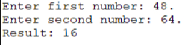
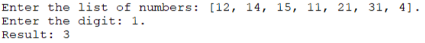
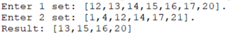
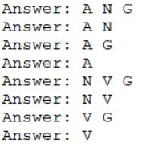

# Ившин Артём КМБ-2 Лабораторная №4

## Задача 1

### Текст задачи

Составить программу вычисления наибольшего общего делителя двух натуральных чисел. 

### Алгоритм решения

1 - Запросить на ввод два натуральных числа
2 - Использовать созданные правила, а именно:
2.1 - если одно из чисел равно 0, то ответ другое ненулевое число
2.2 - если одно из чисел делиться на другое без остатка, то ответ это делитель
2.3 - если первое число больше второго, то находиться остаток от деления первого на второе и рекурсивно вызывается условие, где первое число заменяется остатком от деления
2.4 - если первое число меньше второго, то рекурсвикно вызывается условие, где первое и второе меняются местами
5 - Используем правило для поиска НОД
6 - Выводим результат

### Тестирование

## Задача 2

### Текст задачи

### Алгоритм решения

1 - Запросить на ввод список натуральных чисел и цифру
2 - Использовать факт что если список пустой, то поиск закончен
3 - Использовать правила, что если число в списке заканчивается заданной цифрой, то увеличивать счётчик, иначе не увеличивать, так пройтись по всем элементам списка
4 - Вывести количество чисел, оканчивающихся заданной цифрой

### Тестирование

## Задача 3

### Текст задачи

Определим множество как список без повторяющихся элементов. Найти
разность множеств.

### Алгоритм решения

1 - Запросить на ввод два множества
2 - Использовать правила есть ли элемент в множестве
3 - Использовать правила если элемент есть в двух множествах или есть только во втором, то не брать его, иначе он будет включён в ответ
4 - Вывести итоговое множество

### Тестирование

## Задача 4

### Текст задачи

Задача «Пятеро друзей».
Пятеро друзей решили записаться в кружок любителей логических задач:
Андрей (А), Николай (N), Виктор (V), Григорий (G), Дмитрий (D).
Но староста кружка поставил им ряд условий: «Вы должны приходить к нам
так, чтобы:
1 если А приходит вместе с D, то N должен присутствовать обязательно;
2 если D отсутствует, то N должен быть, а V пусть не приходит;
3 А и V не могут одновременно ни присутствовать, ни отсутствовать;
4 если придет D, то G пусть не приходит;
5 если N отсутствует, то D должен присутствовать, но это в том случае, если не
присутствует V;
6 если же и V присутствует при отсутствии N, то D приходить не должен, a G
должен прийти».
В каком составе друзья смогут прийти на занятия кружка?

### Алгоритм решения

1 - Использовать правила, при которых подходит комбинация, при которой совпадают все условия из текста задачи
2 - Перебрать все варианты, где true, если человек присутсвует, false - отсутствует
3 - вывести все пожходящие варианты

### Тестирование

